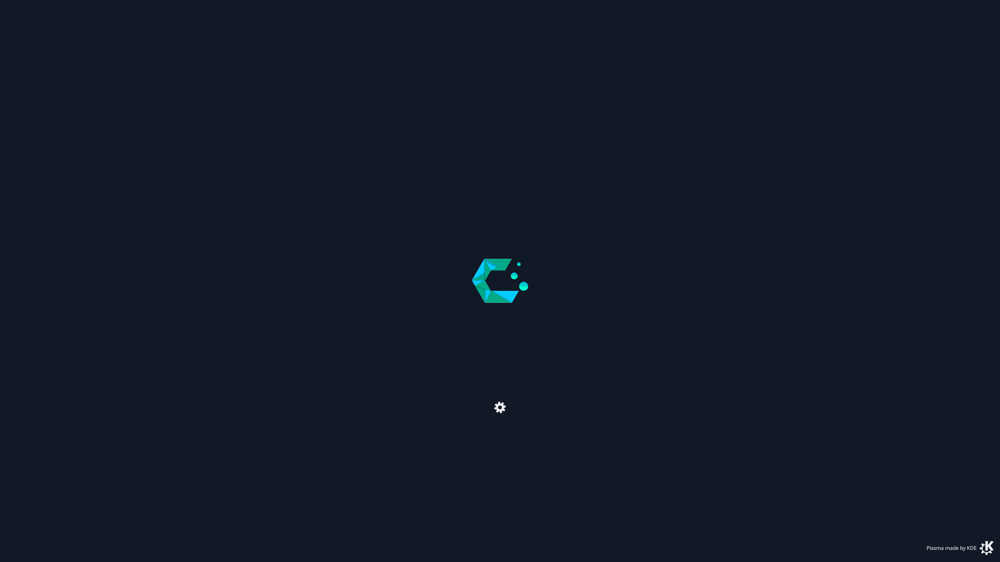

# cachy-splash
Custom Cachy splash screen for KDE Plasma 6 based on the KDE Breeze splash screen (GPL-2.0). 

CachyOS logo © CachyOS, used with attribution.

Place the cachyos-breeze-splash folder in ~/.local/share/plasma/look-and-feel/cachyos-breeze-splash/ and it should be visible in KDE System Settings:

Colours & Themes > Global Theme > Splash Screen

